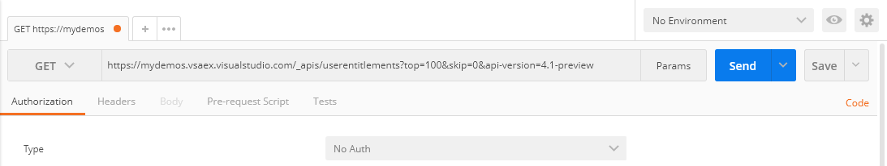

# Contributing to VSTeam

I am truly grateful for all the support developing VSTeam. It means a lot that you spend your time to help improve this module.

## Steps to contribute

1. Visit [docs.microsoft.com](http://cda.ms/4j) and find the API you want to wrap.
2. Explore the API and get familiar with it.
3. Fork this repository and create a branch for your work.
4. Install the `SHiPS` PowerShell module
5. Install the `Trackyon.Utils` module
6. Write help. **It is important that you do this before you start adding the function.**
7. Write unit tests.
8. Code the function.
9. *If needed:* Add type file.
10. *If needed:* Add format file.
11. Update the CHANGELOG.md file.
12. Goto 4 for next function.

## Running Integration tests

- Install SonarQube extension
- Set the following Environment variables.
  - `$env:ACCT = VSTS` Account Name or full TFS URL including collection
  - `$env:API_VERSION = TFS2017` or TFS2018 / AzD2019 for on-prem versions, or VSTS for the Service variant, depending on the value used for ACCT
  - `$env:EMAIL` = Email of user to remove and re-add to account
  - `$env:PAT` = Personal Access token of ACCT

### Housekeeping

This module runs on Mac, PC and Linux. Therefore, **casing is very important**.  When you update the psd1 file the casing of the files must match those on disk. If they do not there could be issue loading the module on Mac and Linux.

### Explore the API

To access the REST API, you are going to need a Personal Access Token (PAT). You can learn how to create a PAT from the [Authenticating with personal access tokens](http://cda.ms/4k) topic of [docs.microsoft.com](http://cda.ms/4k). Once you have a PAT start [Postman](https://www.getpostman.com). If you do not have Postman you can download it from getPostman.com.

I normally begin with Get-xxx function of any API. For the purpose of this document I am going to use the [User Entitlements API](http://cda.ms/4m). This function will combine the Get and List APIs.  I will begin with List. Using the sample request enter the data into Postman.

```HTTP
GET 'https://vsaex.dev.azure.com/{organization}/_apis/userentitlements?top={top}&skip={skip}&api-version=5.1-preview.2'
```

Replace `{organization}` with just the portion of your Azure DevOps (AzD) URL after "https://dev.azure.com" For `{top}` I am going to enter 100 and for `{skip}` 0. Postman should look similar to the image below.



Now before we press Send we have to enter our PAT. Select "Basic Auth" for Type under Authorization. You can leave the Username empty. For your Password copy and paste in your PAT.


Now you can press Send. Postman will issue the request and display the results at the bottom of the user interface.


This confirms that we know how to build a complete request to the service. This is an opportunity to explore all the parameters of the API and make sure you know what to expect.

### Get the code

Now it is time to get your hands on VSTeam. Fork this repository, clone it to your development machine and create a branch for your work.

Certainly, here's the updated text for the "### Write Help" section and a new "### Troubleshooting Help Errors" section:

---

### Write Help

Every new function must have help that explains how to use it. The help can be authored using Markdown in the .docs folder. The help is generated using a combination of [platyPS](https://github.com/PowerShell/platyPS) and [markdown-include](https://github.com/sethen/markdown-include).

- **platyPS**: Enables the authoring of External Help with Markdown.
- **markdown-include**: Provides the capability to reuse Markdown content by allowing inclusion of markdown files into other markdown files using a C style include syntax.

Writing the help documentation before starting with the function can be a beneficial approach. This strategy ensures:
- Consideration of all potential use cases for the function.
- Identification of the necessary parameters to support.
- Efficient time management by handling the more tedious task of documentation first, allowing you to focus on the exciting coding part later.

To ensure your documentation is correctly formatted and complete, run the snippet below. This will generate the help files and allow you to verify their accuracy.

```powershell
#only generates the help files. This is an incomplete build
.\Build-Module.ps1 -buildHelp -skipLibBuild
```

#### Troubleshooting Help Errors

If you encounter errors during the help generation, consider the following common issues and their resolutions:

- **Missing Examples**: Ensure that every cmdlet has at least one example under the "## EXAMPLES" section.

- **Undocumented Parameters**: Confirm that all parameters for a cmdlet are documented under the "## Parameters" section. Standard parameters like "Verbose", "Debug", and "OutBuffer" are usually auto-documented and might not need explicit documentation.

- **Case Sensitivity**: While PowerShell cmdlet and parameter names are case-insensitive, ensure consistency in your documentation for clarity.

- **Invalid Markdown Syntax**: Check for incorrect or incomplete Markdown formatting, which might lead to generation errors.

Remember, the goal is to provide clear and comprehensive documentation to guide users effectively. Following the established guidelines ensures that users can understand and use the functions with ease.

### Write Unit Test

Using [Pester](https://github.com/pester/Pester) 5.x write unit test for the new function. I am a firm believer if I cannot write a test before I write the code I am not clear on what I expect the code to do. After writing the help first writing the unit tests should be pretty straight forward.

At first it will feel odd to write the help and test first but the more you do it the easier it gets.

Because I will not be over your shoulder you could write the tests and even the help after. **Just know if your pull request does not have tests and help it will be rejected.**

**Note**: GitHub secret scanner is actiaved on this repository. We will not merge Pull Request which have real secrets committed. Exceptions are fake secrets for testing.

### Code the function

By now there should be a module that has already wrapped an API similar to the one you are wrapping now. Use that code as template for your module. Consistency is very important to me and will slow the pull request process if the changes are not consistent with those already in the module.

If you feel the conventions should be changed please log and issue so we can discuss.

### Add a type file

Type files go in the types folder.

See PowerShell documentation for more explanation: https://docs.microsoft.com/en-us/powershell/module/microsoft.powershell.core/about/about_types.ps1xml?view=powershell-6

### Add a format file

Format files go in the formats folder.

See PowerShell documentation for more explanation: https://docs.microsoft.com/en-us/powershell/module/microsoft.powershell.core/about/about_format.ps1xml?view=powershell-6

### Update CHANGELOG.md

Update the CHANGELOG.md file with your changes.
