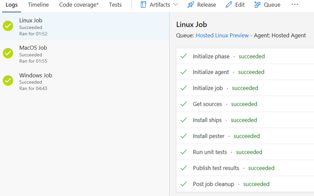
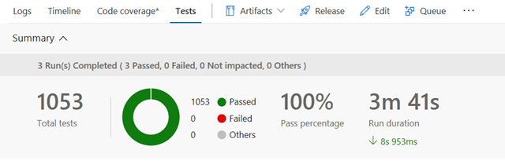

# VSTeam

[](https://github.com/DarqueWarrior/vsteam/blob/master/LICENSE)
[](https://github.com/DarqueWarrior/vsteam/blob/master/docs/readme.md)
[](https://www.powershellgallery.com/packages/VSTeam)
[](https://github.com/PowerShell/PowerShell)

## Introduction

VSTeam is a PowerShell module with commands for accessing your [Azure DevOps Server (previously named Visual Studio Team Foundation Server) 2017/2018](https://cda.ms/Bf) and [Azure DevOps (previously named Visual Studio Team Services)](https://cda.ms/Bf).

The VSTeam module is also a provider allowing users to navigate their [Azure DevOps Server](https://cda.ms/Bf) and [Azure DevOps](https://cda.ms/Bf) as a file system.

To get started you can visit this blog [PowerShell I would like you to meet TFS and VSTS](http://www.donovanbrown.com/post/PowerShell-I-would-like-you-to-meet-TFS-and-VSTS)

## Pipeline Status

You can review the status of every stage of the pipeline below.

|         Stage                       |             Status           |
|-------------------------------------|------------------------------|
| Build                               | [](https://loecda.visualstudio.com/Team%20Module/_build/latest?definitionId=52)|
| Linux Team Foundation Server 2017   | [](https://loecda.visualstudio.com/Team%20Module/_releases2?definitionId=1&view=mine&_a=releases) |
| macOS Team Foundation Server 2017   | [](https://loecda.visualstudio.com/Team%20Module/_releases2?definitionId=1&view=mine&_a=releases) |
| Windows Team Foundation Server 2017 | [](https://loecda.visualstudio.com/Team%20Module/_releases2?definitionId=1&view=mine&_a=releases) |
| Windows Team Foundation Server 2018 | [](https://loecda.visualstudio.com/Team%20Module/_releases2?definitionId=1&view=mine&_a=releases) |
| Windows Azure DevOps | [](https://loecda.visualstudio.com/Team%20Module/_releases2?definitionId=1&view=mine&_a=releases) |
| Publish to PowerShell Gallery       | [](https://loecda.visualstudio.com/Team%20Module/_releases2?definitionId=1&view=mine&_a=releases) |

The build for VSTeam is run on macOS, Linux and Windows to ensure there are no casing or other platform specific issues with the code.



 On each platform unit tests are run.

 

During the release the module is installed on macOS, Linux and Window and tested against [Azure DevOps Server](https://cda.ms/Bf) and [Azure DevOps](https://cda.ms/Bf) before being published to the PowerShell Gallery.

## Requirements

- Windows PowerShell 5.0 or newer.
- PowerShell Core.

## Module Dependencies

- [SHiPS module](https://www.powershellgallery.com/packages/SHiPS/)
- [Trackyon.Utils module](https://www.powershellgallery.com/packages/Trackyon.Utils)

## Building Module

In an effort to reduce the module size this repository contains two scripts Build-Module.ps1 and Merge-File.ps1 that merges similar files into a single file. The files in the formats folder are merged into vsteam.format.ps1xml. The files in the classes folder are merged into vsteam.classes.ps1. The functions from the Private and Public folders are merged into vsteam.functions.ps1. Finally all the files in the types folder are merged into vsteam.types.ps1xml. The order of the files being merged can be controlled by the _*.json files in the repository.

The JSON files must be in the following format:

```JSON
{
   "outputFile": "vsteam.functions.ps1",
   "fileType": "functions",
   "files": [
      "./Private/*.ps1",
      "./Public/*.ps1"
   ]
}
```

The final module is stored in a dist folder by default. You can override this folder by using the -outputDir parameter to the Build-Module.ps1 script.

To generate the help add the -buildHelp switch parameter.

You can also use the -installDep switch parameter to install all the module dependencies to bootstrap your development.

## Contributors

[Guidelines](.github/CONTRIBUTING.md)

## Change Log

[Change Log](CHANGELOG.md)

## Maintainers

- [Donovan Brown](https://github.com/darquewarrior) - [@DonovanBrown](https://twitter.com/DonovanBrown)

## License

This project is [licensed under the MIT License](LICENSE).
