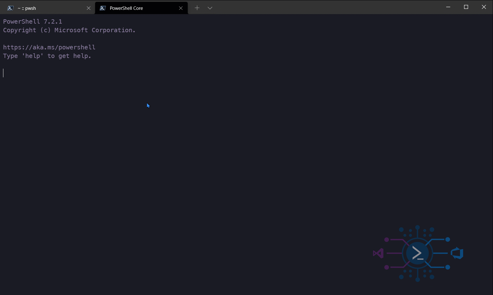

<h1 align="center">
  <a href="https://pnp.github.io/cli-microsoft365">
    
  </a>
  <br>VSTeam<br>
</h1>

 <p align="center">
    PowerShell module to automate Azure DevOps
    <br />
    <a href="https://methodsandpractices.github.io/vsteam-docs"><strong>Explore the docs »</strong></a>
  </p>
<p align="center">

  <a href="https://github.com/MethodsAndPractices/vsteam/actions/workflows/actions-pipeline.yml">
   
  </a>

  <a href="https://twitter.com/climicrosoft365">
   
  </a>

 <a href="https://www.powershellgallery.com/packages/VSTeam">
   
  </a>
</p>

<p align="center">
  <a href="https://github.com/MethodsAndPractices/vsteam/blob/trunk/LICENSE">
    
  </a>
  <a href="CODE_OF_CONDUCT.md">
    
  </a>
  <a href="https://github.com/MethodsAndPractices/vsteam/blob/trunk/LICENSE">
    
  </a>

</p>


<p align="center">
  <a href="#about-the-project">About the project</a> |
  <a href="#requirements">Requirements</a> |
  <a href="#install">Install</a> |
  <a href="CHANGELOG.md">Change Log</a> |

</p>
<p align="center">
  <a href="github/CONTRIBUTING.md">Contribute</a> |
  <a href="#buildin-gmodule">Building Module</a> |
  <a href="#mantainers">Maintainers</a>
</p>

<p align="center">
  
</p>

## About The Project

VSTeam is a PowerShell module with commands for accessing your [Azure DevOps Server](https://cda.ms/Bf) and [Azure DevOps Services)](https://cda.ms/Bf).

The VSTeam module is also a provider allowing users to navigate their [Azure DevOps Server](https://cda.ms/Bf) and [Azure DevOps](https://cda.ms/Bf) as a file system.

To get started you can visit this blog [PowerShell I would like you to meet TFS and VSTS](http://www.donovanbrown.com/post/PowerShell-I-would-like-you-to-meet-TFS-and-VSTS)

## Requirements

- Windows PowerShell 5.0 or newer.

The following modules are dependencies of the VSTeam module:

- [SHiPS module](https://www.powershellgallery.com/packages/SHiPS/)
- [Trackyon.Utils module](https://www.powershellgallery.com/packages/Trackyon.Utils)

## Install

Install this module from the [PowerShell Gallery](https://www.powershellgallery.com/packages/VSTeam)

```powershell
Install-Module -Name VSTeam -Repository PSGallery -Scope CurrentUser
```

## Change Log

Look at the [Change Log](CHANGELOG.md) file or the release notes on the [GitHub releases](https://github.com/MethodsAndPractices/vsteam/releases).


## Contribute

Check the [Guidelines](.github/CONTRIBUTING.md) if you want to contribute.

## Building Module

To run build the script Build-Module.ps1. The script has the following parameters:

* `-outputDir 'C:\outputdir'`: The final module is stored in a dist folder by default. You can override this folder by using the parameter
* `-buildHelp`: Building help is skipped by default to speed your inner loop. Use this flag to include building the help
* `-installDep`: By default the build will not install dependencies unless this switch is used
* `-ipmo`: build module will be imported into session. IF a loaded module exist, it will be overwritten with the build version.
* `-analyzeScript`: run the static code analyzer for the scripts with PSScriptAnalyzer
* `-runTests`: runs the unit tests
* `-testName 'tests to filter'`: can be used to filter the unit test parts that should be run. Wildcards can be used! See [the Pester documentation](https://github.com/pester/Pester/wiki/Invoke%E2%80%90Pester#testname-alias-name) for a more elaborate explanation.
* `-codeCoverage`: outputs the code coverage. Output by default is NUnit

Below are some examples on how to build the module locally. It is expected that your working directory is at the root of the repository.

Builds the module, installs needed dependencies, loads the module into the session and also builds the help.
```powershell
.\Build-Module.ps1 -installDep -ipmo -buildHelp
```

<details>
  <summary>about module size</summary>
In an effort to reduce the module size this repository contains two scripts `Build-Module.ps1` and `Merge-File.ps1` that merges similar files into a single file. The files in the formats folder are merged into `vsteam.format.ps1xml`. The files in the classes folder are merged into `vsteam.classes.ps1`. The functions from the Private and Public folders are merged into `vsteam.functions.ps1`. Finally all the files in the types folder are merged into `vsteam.types.ps1xml`. The order of the files being merged can be controlled by the `config.json` files in the repository.

The JSON config file must be in the following format:

```JSON
{
   "types" : {
      "outputFile": "vsteam.types.ps1xml",
      "path": "./Source/types/",
      "fileType": "types",
      "files": [
         "*.ps1xml"
      ]
   },
   "functions" : {
      "outputFile": "vsteam.functions.ps1",
      "path": "./Source/",
      "fileType": "functions",
      "files": [
         "./Private/*.ps1",
         "./Public/*.ps1"
      ]
   },
   "formats": {
      "outputFile": "vsteam.format.ps1xml",
      "path": "./Source/formats/",
      "fileType": "formats",
      "files": [
         "vsteam_lib.TaskGroup.TableView.ps1xml"
      ]
   }
}
```
</details>


### Run Tests Locally

Runs all unit tests and executes the static code analysis.
```powershell
.\Build-Module.ps1 -runTests -codeCoverage -analyzeScript
```

Runs the tests, but executes only the unit tests that have the description "workitems" for the logical grouped unit tests. This can be used if you only want to test a portion of your unit tests.
```powershell
.\Build-Module.ps1 -runTests -testName workitems
```

### Run Tests in Docker

You can [run your unit tests also locally](/tools/docker/RunTestsLocally.md) and cross-platform in a standardized environment.

## Maintainers

- [Donovan Brown](https://github.com/darquewarrior) - [@DonovanBrown](https://twitter.com/DonovanBrown)
- [Sebastian Schütze](https://github.com/SebastianSchuetze) - [@RazorSPoint](https://twitter.com/RazorSPoint)


## License

This project is [licensed under the MIT License](LICENSE).
